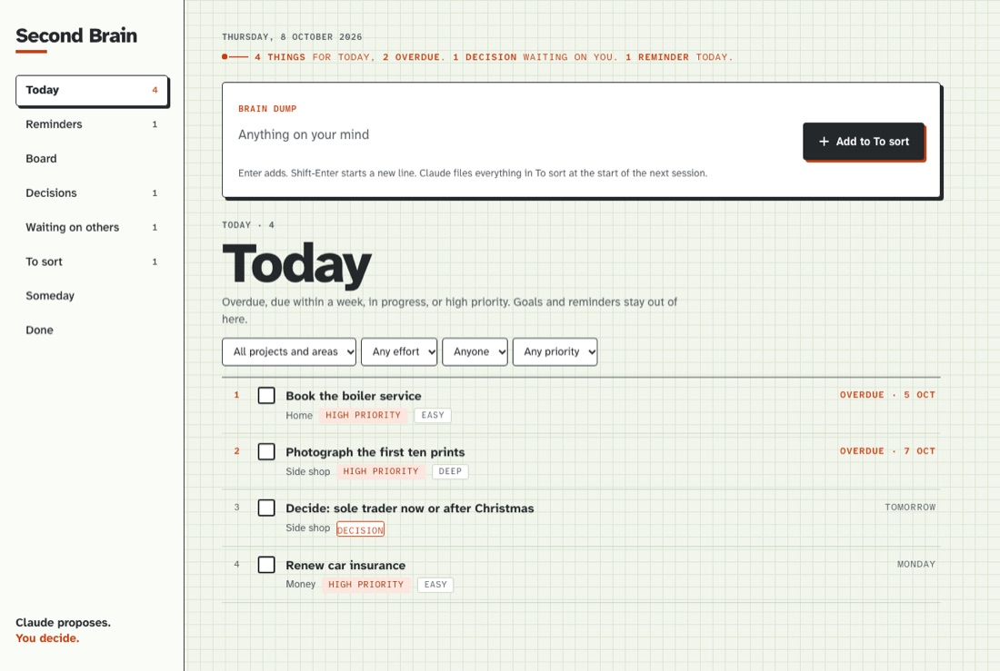
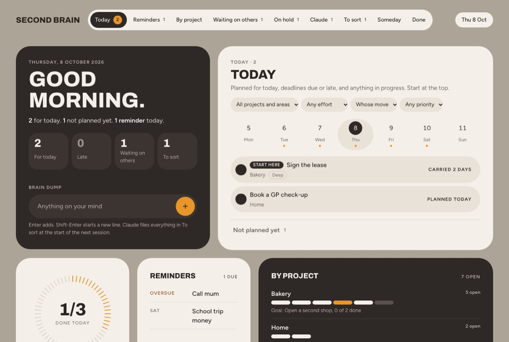
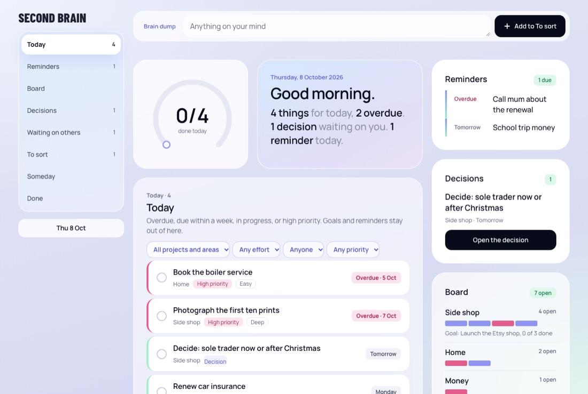
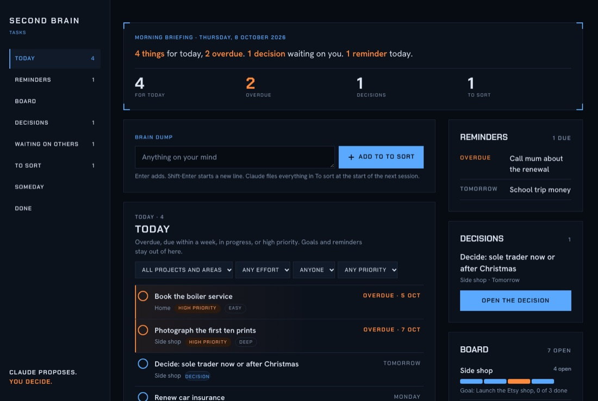

# Second Brain

A folder that remembers. It's plain markdown files, a few small scripts, and Claude Code opened in the folder. Before it answers, Claude reads who you are and what you're working on. It files what you throw at it, keeps your task list and reminders, and writes down what changed at the end of every session.

Your notes are files on your computer, not inside someone's app. Claude reads the ones it needs over the internet each session, like any Claude chat.

## What you need

- **A Mac or Windows computer.**
- **Claude Code**, which needs a Claude Pro or Max plan. The easiest way in is the **Code** tab in the [Claude desktop app](https://claude.com/download), which needs no terminal. The [terminal version](https://claude.com/claude-code) works too. Pro has usage limits, and setup uses a good share of one session.
- **Python 3.9 or newer.** It runs the task board, and you never touch it yourself.
  - On a Mac, the first time it's used you may get a pop-up offering to install Apple's developer tools. Click Install.
  - On Windows, install it from python.org and tick "Add to PATH".
- **[Obsidian](https://obsidian.md)** (free, optional): see below.
- **A Google account** (optional). Connecting Google Calendar puts your day in the morning briefing. Connecting Google Tasks gives you a list on your phone to capture things into while you're out.

## Start

1. **Get the folder.** Click **Code → Download ZIP** above, unzip it, and put it somewhere sensible like `Documents/Second Brain`. If you know GitHub, **Use this template** also works, but make your copy private: it will hold notes about you.
2. **Open it in Claude Code.** In the desktop app, go to the Code tab and choose the folder. In a terminal, go to the folder and run `claude`:
   - Mac: open Terminal, type `cd `, drag the folder onto the window, and press Enter.
   - Windows: open the folder in Explorer, click the address bar, type `cmd`, and press Enter.
3. **Say "Set me up."**

Claude reads `SETUP.md`, interviews you, and builds the folder around your answers. It takes about an hour, most of it talking. You approve what it writes about you before anything else happens.

The first time you open the folder, Claude Code asks whether you trust it. Say yes: that's what switches on the folder's settings. After that, Claude still asks before it runs things on your computer. The folder's own scripts are pre-approved, so most of what it asks during setup is a one-off, and it's fine to say yes. If setup gets interrupted, open the folder again and say "carry on": it picks up where it stopped.

After that, everything is a conversation: "what's on today?", "file this", "remind me to call the bank on Friday", "what did we decide?". Each session starts with a short brief (`/brief`) and ends with a wrap-up (`/wrap`); setup asks what you want in both.

## How it's organised

PARA, with one change. In the original, a project is anything with a finish line, so a business would be an area. Here, Projects is your work and Areas is your life, and the finish-line things live inside them as goals and tasks. We found that easier to live with.

| | |
|---|---|
| `Inbox/` | Anything, unfiled. Claude sorts it. |
| `Projects/` | Your work: a business, a side business, client work, something you're building. One folder each. |
| `Areas/` | Your life: health, money, home, family, the day job, study. One folder each. |
| `Resources/` | Reference, research and ideas, plus a To watch list. |
| `Tasks/` | One note per task, goal or reminder, and the board that shows them. |
| `Archive/` | Finished or dead. Finished things are never deleted. |
| `Me.md` | Who you are and how you work. Written from the interview. Yours: Claude only changes it when you ask. |
| `Map.md` | Where everything lives. |
| `CLAUDE.md` | The rules Claude follows in this folder. Short on purpose. |
| `SETUP.md` | The setup Claude runs for you. |
| `Scripts/` | The task board, its four styles, and two helpers. Python, nothing to install. |
| `.claude/settings.json` | Pre-approves the folder's own scripts, so Claude doesn't ask every time. |

**Tasks, goals and reminders.** A task is a piece of work. A goal is a finish line with tasks under it ("Sell the flat"). A reminder is a nudge on a date ("Call mum on Friday") and lives in its own list, so it doesn't clog the work. The test: if you'd want to know later that it was done and why, it's a task; if you only need not to forget it, it's a reminder.

## Links and Obsidian

Notes link to each other with `[[double brackets]]`. Claude makes those links whether or not you use Obsidian, because they're how it finds its way around the folder.

Obsidian is a free notes app that opens this folder as it is. It makes the links clickable, draws the graph of how things connect, and shows each project's tasks as a table inside its note (that needs Obsidian 1.9 or later). Without it, the notes are still plain text you can open in anything, and the board still shows every task; you just lose the clicking and the tables.

## The task board

Say "open the board", and Claude starts it and gives you http://127.0.0.1:8765/. It has:
- a box at the top for dumping thoughts;
- Today, your plan for the day (below);
- your reminders;
- everything grouped by project and area;
- what you're waiting on from other people, and what's on hold.

**What's on Today.** Anything you planned for today or an earlier day, anything with a deadline today or already past, and anything you've marked as in progress. Deadlines come first, then the big jobs, then the quick ones, and the first row says "Start here". Important things with no day yet sit underneath in "Not planned yet": give one a day and it moves onto Today.

It runs while that Claude session is open. When the session closes, the board goes too, but your tasks are files and lose nothing.

It comes in four styles. During setup Claude shows you your own board in each one and asks which you want; Show Your Working is the default, and you can switch any time by asking.

| | |
|---|---|
| **Show Your Working**: engineering paper, graphite ink, one red-orange for whatever needs you. | **Warm Bento**: cream cards on taupe, an espresso card for what's in focus, orange for act now. |
|  |  |
| **Aura**: frosted glass on periwinkle, a gradient arc that fills with the day, mint for done. | **Oracle**: a dark command centre with a morning briefing; blue for what Claude tells you, orange for what needs you. |
|  |  |

If the folder syncs to your phone (iCloud Drive, OneDrive, Dropbox, Google Drive), `Tasks/Board.html` is a read-only copy you can open there. It updates each time Claude syncs your tasks. With two computers on one folder, let the sync finish before you shut the laptop: wait for the Google Drive, OneDrive, Dropbox or iCloud icon to say it's up to date. Otherwise the other computer starts from an old copy, and the sync service keeps both versions as a "(1)" conflict copy. If two computers share the folder, Claude sets one of them to write it, so the sync service doesn't make conflict copies.

### Words on the board

| | |
|---|---|
| **Planned** | The day you mean to do it. A planned day puts a task on Today when it arrives. |
| **Deadline** | A real date someone else set. Late deadlines show first on Today. |
| **Carried N days** | You planned it for an earlier day and it's still not done. |
| **Not planned yet** | Important, or due within a week, but with no planned day. |
| **Effort** | Deep (a focused block), medium (an ordinary session) or quick (minutes), so you can pick one that fits the time you have. |
| **Decision** | A yes/no call that's yours to make. The morning brief lists them, oldest first. |
| **Whose move** | Who has to act next. Someone else's moves the task to Waiting on others. |
| **Waiting on others** | Someone outside owes you something. Each one has a chase date; "Chased them today" moves it a week on. |
| **On hold** | Waiting on another of your tasks to be finished first. The row says which one. |
| **To sort** | Things from the brain dump that Claude hasn't filed yet. |
| **Someday** | Parked on purpose. It stays out of every list until you bring it back. |
| **Dropped** | Not doing it after all. The board asks you why, so you'll know later. |

## Backup and history

It's a folder, so back it up the way you back up anything else. If it lives in iCloud Drive, OneDrive, Dropbox or Google Drive, it's already copied. Keep it fully on the computer: in Google Drive for desktop choose **Mirror files**, not Stream files, and don't make the folder "online-only" in OneDrive (Files On-Demand) or Dropbox. Streamed files are fetched one by one when opened, so the task scripts, which read every note, run slowly or see a placeholder instead of the file. If you'd like a history of every change, make it a git repo; Claude will commit at the end of each session.

## Made by

Sol Khan, from the folder he runs his own businesses out of. Claude Code only for now.

## License

MIT: use it, change it, share it, keep the copyright line. See [LICENSE](LICENSE). Your own notes are yours; the license only covers the template.
